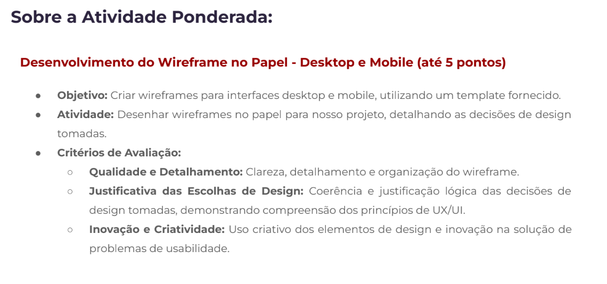
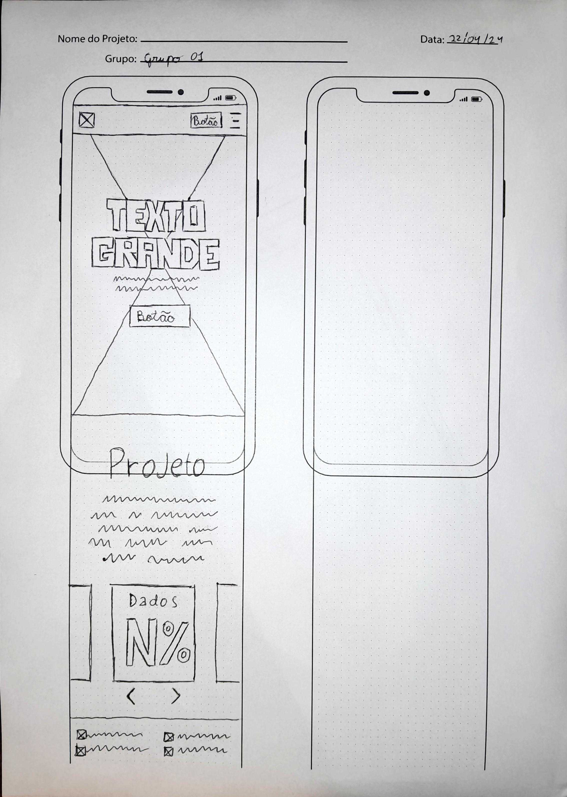
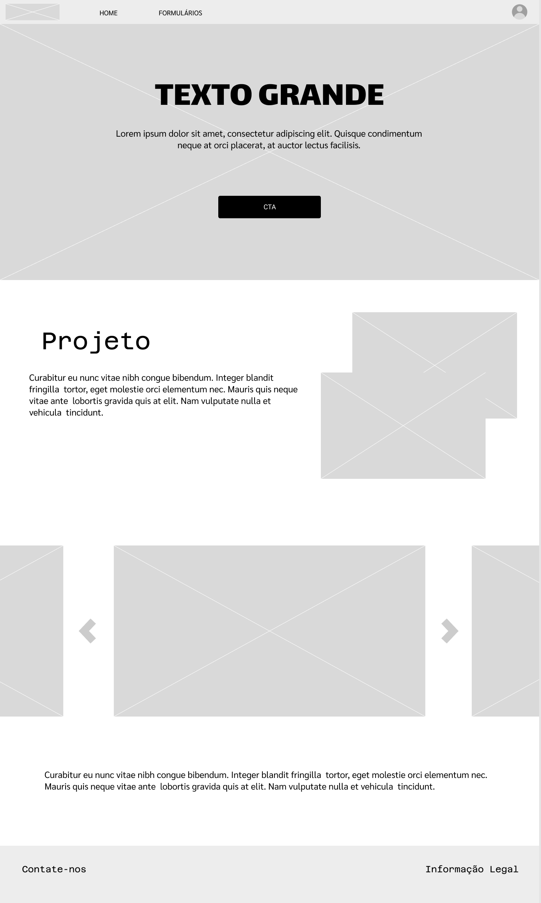

# Wireframe-Ponderada-de-UX

## :student: Integrantes: 
- <a href="https://www.linkedin.com/in/calebe-matias/">Calebe Yan Veras Matias</a>
- <a href="https://www.linkedin.com/in/giovanna-britto/">Giovanna Fátima de Britto Vieira</a>
- <a href="https://www.linkedin.com/in/gucolombini/">Gustavo Colombini</a> 
- <a href="https://www.linkedin.com/in/j%C3%BAlia-lika-ishikawa/">Júlia Lika Ishikawa</a> 
- <a href="https://www.linkedin.com/in/leonardo-ogata-983b032b5/">Leonardo Ogata Pedrosa</a>
- <a href="https://www.linkedin.com/in/lucas-ramenzoni-jorge-083770302/">Lucas Ramenzoni Jorge</a> 
- <a href="https://www.linkedin.com/in/wildis-filho/">Wildisley José de Souza Filho</a>

## 1. Instruções da Ponderada
Conforme apresentado durante a aula, as instruções da ponderada são:

Figura 1 - Instrução da Ponderada

Fonte: Material produzido pelos autores (2024).

Figura 2 - Instrução da Ponderada

Fonte: Material produzido pelos autores (2024).

## 2. Wireframe

&nbsp;&nbsp;&nbsp;&nbsp; Em web design, o wireframe é uma representação visual da estrutura e funcionalidade de uma página web ou tela de celular. Esses esboços são utilizados no início do processo do desenvolvimento da aplicação para estabelecer a estrutura preliminar da página antes da adição de elementos visuais, paleta de cores e conteúdo. Os Wireframes podem ser criados no papel, utilizando ferramentas de design gráfico, ou mesmo em HTML/CSS, que ajuda a visualizar a disposição dos elementos e a navegação do usuário.

&nbsp;&nbsp;&nbsp;&nbsp; Sendo assim, foram feitos alguns wireframes, divididos em versão mobile e versão desktop, sendo os de versão mobile:

Figura 3 - Wireframe da Tela Inicial Físico: Versão Mobile.

Fonte: Material produzido pelos autores (2024).

Figura 4 - Wireframe do Login Físico: Versão Mobile.

Fonte: Material produzido pelos autores (2024).

Figura 5 - Wireframe do Cadastro Físico: Versão Mobile.

Fonte: Material produzido pelos autores (2024).

E os de versão desktop:

Figura 6 - Wireframe da Tela inicial: Versão Desktop.

Fonte: Material produzido pelos autores (2024).

Figura 7 - Wireframe da Tela inicial: Versão Desktop.

Fonte: Material produzido pelos autores (2024).

&nbsp;&nbsp;&nbsp;&nbsp; Dessa forma, para obter a validação da aplicação antes do seu desenvolvimento foram definidos alguns tipos de Wireframes, sendo três principais: wireframe de baixa fidelidade, wireframe de média fidelidade e wireframe de alta fidelidade, sendo que a quantidade de detalhes é o que diferencia cada uma delas.

&nbsp;&nbsp;&nbsp;&nbsp; Conforme apresentado pelo MindGroup technologies, os wireframes de baixa fidelidade são representações visuais básicas e servem como ponto de partida do design. Eles omitem detalhes distrativos e incluem imagens simplistas, blocos e conteúdos simulados. Enquanto isso, os wireframes de média fidelidade representam mais precisamente o layout da aplicação, contendo imagens e tipografias, com alguns detalhes atribuídos a componentes e recursos específicos.  Por fim, os wireframes de alta fidelidade apresentam os layouts específicos para pixels, e incluem o preenchimento de textos pseudo-latino e caixas preenchidas com um “X” para representar uma imagem.

&nbsp;&nbsp;&nbsp;&nbsp; Sendo assim, considerando as necessidades do projeto foram feitos wireframes de média fidelidade para as telas de início, telas de login, telas de cadastro e tela do dashboard do administrador, que apresentam uma representação mais precisa do layout, porém sem distrações como imagens. Enquanto, as telas dos formulários consistem em wireframes de alta fidelidade devido a relevância do conteúdo escrito e dos elementos dos formulários (figura 7).

Figura 7 - Wireframe Geral: Versão Mobile.

Fonte: Material produzido pelos autores (2024).

&nbsp;&nbsp;&nbsp;&nbsp; Além disso, utilizando a técnica conhecida por Mobile First, desenvolvida por Luke Wroblewski em 2009 e 2010, e objetivando que o usuário tenha a melhor experiência possível com a aplicação, os wireframes foram feitos considerando os dispositivos móveis. Entretanto, foram feitos alguns wireframes de média fidelidade para dispositivos desktops.

&nbsp;&nbsp;&nbsp;&nbsp; Dessa forma, a primeira tela desenvolvida consiste na tela inicial (figura 8) que apresenta uma navbar, com a logo do projeto (redireciona para a tela inicial), um ícone de login (redireciona para a página de login) e um menu (apresenta um menu suspenso com as possíveis abas para navegação). Também há a área de conteúdo principal que contém uma imagem, com um título, um subtítulo centralizado e um botão que redireciona para a página de login. Além disso, foi disposto um texto cortado na tela, que serve como incentivo para o usuário rolar a tela para baixo e ver o restante do conteúdo: alguns textos e alguns textos com informações e dados, por fim há o rodapé da página, com algumas informações extras. 

Figura 8 - Wireframe Tela Inicial: Versão Mobile.

Fonte: Material produzido pelos autores (2024).

&nbsp;&nbsp;&nbsp;&nbsp; A segunda tela (figura 9) desenvolvida consiste em uma página de login, então possui caixas de texto para o usuário inserir o e-mail e a senha, além de um botão para o envio dessas informações, um link para a página de cadastro e outro link para caso o usuário esqueça a senha. Por fim, há três botões na parte inferior da tela que servem para facilitar a autenticação do usuário e um rodapé com informações extras.

Figura 9 - Wireframe Tela de Login: Versão Mobile.

Fonte: Material produzido pelos autores (2024).

&nbsp;&nbsp;&nbsp;&nbsp; Já a terceira tela (figura 10) consiste na página de cadastro, que contém o título da página, quatro caixas de texto para inserção do nome, e-mail, senha e confirmação de senha, e por fim apresenta o botão de cadastro e o rodapé da página.

Figura 10 - Wireframe Tela de Cadastro: Versão Mobile.

Fonte: Material produzido pelos autores (2024).

&nbsp;&nbsp;&nbsp;&nbsp; Além disso, o parceiro disponibilizou dois modelos de formulários que incluem perguntas a serem respondidas pelo usuário. Sendo assim, as próximas telas consistem nesses formulários e possuem elementos como: caixas de texto, caixas de seleção, radioButton, date chooser, num. Stepper e outros. Dessa forma, é possível perceber que os próximos wireframes são mais robustos e apresentam informações e elementos mais consistentes.

Figura 11 - Wireframe Formulário Resenha: Versão Mobile.

Fonte: Material produzido pelos autores (2024).

Figura 12 - Wireframe Formulário Resenha Continuado: Versão Mobile.

Fonte: Material produzido pelos autores (2024).

&nbsp;&nbsp;&nbsp;&nbsp; Conforme as imagens acima (figuras 11 e 12), os elementos presentes nas duas telas do formulário resenha consistem em:
- Navbar;
- Number Stepper;
- Combo Box
- Radio Button;
- H. Slider;
- Text input;
- Button;
- Checkbox;
- Footer;

&nbsp;&nbsp;&nbsp;&nbsp; Enquanto isso no formulário para os tutores que possuem cachorro há mais questões a serem respondidas, logo foram utilizados diversos tipos de elementos que estão divididos nas quatro partes do formulário, sendo esses:

Figura 13 - Wireframe Formulário para quem tem Cachorro: Versão Mobile.

Fonte: Material produzido pelos autores (2024).

**Parte 1 - Formulário para quem tem cachorro (figura 13)**
- Navbar;
- Text Title;
- Text;
- Text input;
- Button Bar;
- Combo Box;
- Radio Button;
- Date Chooser;
- Num. Stepper;
- Button;
- Footer.

Figura 14 - Wireframe Formulário para quem tem Cachorro: Versão Mobile.

Fonte: Material produzido pelos autores (2024).

**Parte 2 - Formulário para quem tem cachorro (figura 14)**
- Navbar;
- Text Title;
- Text;
- Combo Box;
- Radio Button;
- Text Input;
- Button;
- Footer.

Figura 15 - Wireframe Formulário para quem tem Cachorro: Versão Mobile.

Fonte: Material produzido pelos autores (2024).

**Parte 3 - Formulário para quem tem cachorro (figura 15)**
- Navbar;
- Text Title;
- Text;
- Num. Stepper;
- Text Input;
- CheckBox group;
- Button;
- Footer;

Figura 16 - Wireframe Formulário para quem tem Cachorro: Versão Mobile.

Fonte: Material produzido pelos autores (2024).

**Parte 4 - Formulário para quem tem cachorro (figura 16)**
- Navbar;
- Text Title;
- Text;
- Text Input;
- Button Bar;
- Button;
- Footer.

&nbsp;&nbsp;&nbsp;&nbsp; Além dessas, há a tela de dashboard disponível apenas para o usuário administrador (figura 17), em que irá apresentar as respostas dos formulários, sendo assim será composto pela navbar, por gráficos e por tabelas. 

Figura 17 - Wireframe Dashboard: Versão Mobile.

Fonte: Material produzido pelos autores (2024).

&nbsp;&nbsp;&nbsp;&nbsp; Por fim, foram feitos alguns wireframes da versão desktop dessa aplicação. Nessa versão foram utilizados os mesmos elementos da versão mobile, porém as dimensões e proporções se modificaram, porém é possível notar que tanto o header e o footer se mantém em todas as páginas, enquanto nas outras páginas os elementos se diferenciam.

- **Header (presente em todas as páginas):**
O header está presente em qualquer página do website, e caso o usuário desça a página, o header pode ser acessado novamente ao subir levemente a tela, sem necessidade de retornar ao topo. Ele exibe na esquerda o logo do projeto, e na direita alguns botões que permitem que o usuário acesse rapidamente a página inicial, os formulários e a página de login/cadastro.

- **Footer (presente em todas as páginas):**
Assim como o header, o footer está presente em todas as páginas, mas está sempre ao final dela, exibindo informações de contato do projeto e informações legais.

- **Página Inicial**

A página inicial (figura 18) é a primeira página que será exibida ao usuário, tem maior foco em estética e deve incentivar o usuário a responder os formulários, sendo então bem convidativa e exibe um botão para acessar os formulários imediatamente, facilitando para o usuário que entra no website já com a intenção de responder. Ao scrollar um pouco, há uma breve descrição do projeto, assim como alguns dados relevantes que incentivam mais ainda o usuário a fazer a pesquisa.

Figura 18 - Wireframe Página Inicial: Versão Desktop.

Fonte: Material produzido pelos autores (2024).

- **Página Login e Cadastro**

As páginas de login e cadastro (figura 19) são bem simples, possuindo campos de texto para inserção do email e da senha do usuário, ou no caso do cadastro, também se pede o nome do usuário. Há um botão abaixo da confirmação do login caso o usuário tenha esquecido sua senha, que ao ser clicado irá pedir apenas o email para o envio das instruções de restauração de senha.

Figura 19 - Wireframe Página de Login e Cadastro: Versão Desktop.

Fonte: Material produzido pelos autores (2024).

- **Formulário**

Os formulário são as páginas do formulário (figura 20) que deve permitir que o usuário responda todas as perguntas de forma rápida, evitando que o usuário desista antes de terminar. Logo, a página contém campos de seleção de respostas pré-feitas, trazendo praticidade ao usuário e  evitando problemas com respostas iguais sendo salvas separadamente na base de dados. Além disso, sempre que possível serão adicionados elementos que facilitem o processo, como o uso de uma interface de calendário para selecionar uma data. Há também seções de múltipla escolha, onde o usuário pode selecionar uma resposta com apenas um clique. Por fim, há uma caixa de verificação de consentimento, e o botão de envio do formulário, que se torna clicável apenas após todas as respostas e o critério de consentimento terem sido preenchidos.

Figura 20 - Wireframe Formulário: Versão Desktop.

Fonte: Material produzido pelos autores (2024).

Além disso, os wireframes desenvolvidos estão disponíveis para visualização de forma on-line, basta acessar os seguintes links:
<a href="https://www.figma.com/file/fUuFCzOUIciIRVbsLZexoE/Wireframing-(Copy)?type=design&node-id=0-394&mode=design&t=tGvxEH8YGa7fUYLl-0"> Clique para Acessar a Versão Desktop do Wireframe</a>

<a href="https://balsamiq.cloud/sm6k493/p5gyslq"> Clique para Acessar a Versão Mobile do Wireframe</a>

&nbsp;&nbsp;&nbsp;&nbsp; Por fim, em resumo, os wireframes são importantes no desenvolvimento de interfaces e permitem a definição clara da estrutura e funcionalidade das páginas da aplicação web.  Dessa forma foram utilizados para garantir que a interface do projeto seja intuitivas e funcional, e contribua para uma aplicação esteticamente agradável. 

## 3. Justificativa das Escolhas de Design

&nbsp;&nbsp;&nbsp;&nbsp; Considerando os aspectos de usabilidade e os princípios de design de UI/UX (User Interface/User Experience), o projeto foi desenvolvido com o objetivo de proporcionar uma experiência intuitiva para o usuário. Dessa forma todos os elementos presentes nas telas foram pensados de forma a atingir esse objetivo. 

Sendo assim, nos formulários de Resenha, de cadastro, login e para quem tem cachorro, foram considerados:

- **Simplicidade e Clareza:** foi objetivado manter um design limpo e intuitivo.
- **Fluxo Lógico:** foi objetivo manter uma sequência coerente de campos, de forma que o usuário responda os formulários de forma progressiva e coerente.
- **Elementos Conhecidos:** buscando facilitar o entendimento do usuário foram utilizados elementos já conhecidos, como os campos de texto e os botões.

Enquanto isso, para o dashboard do administrador que tem como finalidade exibir os dados obtidos com as respostas dos usuários, foram considerados:

- **Organização Hierárquica:** foi objetivado manter uma organização hierárquica, de forma que o usuário consiga navegar facilmente entre as informações.
- **Facilidade de exibição:** foi objetivo manter uma interface que seja fácil de exibir os dados, de forma que o usuário consiga visualizar os dados de forma rápida e intuitiva.
- **Consistência:** foi objetivo manter uma interface que seja consistente entre as versões mobile e desktop.

Além disso, algumas cosiderações gerais levadas em consideração ao longo das telas, são:

- **Facilidade de Navegação:** uso de elementos de navegação como botões, links e barra de navegação ou menu de navegação, para facilitar a navegação entre as telas.
- **Feedback Visual:** uso de botões e elementos interativos, como cores e sombras, de forma a interagir com os usuários.
- **Tipografia e Espaço em Branco:** objetivando criar uma experiência do usuário que seja limpa e confortável foi escolhido um design minimalista com uso de espaços em branco.
- **Elementos de Ação:** foi pensado que os formulários sejam dividos em partes e que sua transição ocorra por meio de botões de ação, de forma a garantir que o usuário sinta que está progredindo na aplicação.

Além disso, visando que os formulários sejam respondidos de forma rápida e que os dados não sejam corrompidos foram estipulados diversos elementos, citados anteriormente. Dessa forma, cada um desses recursos possuem um papel importante na usabilidade do projeto, sendo esses:

- **Campos de Preenchimento Padronizados:** os campos de preenchimento foram pensados para que o usuário não precise se preocupar com a formatação dos dados.
- **Seletores e Radio Buttons:** para facilitar a resposta do formulário foram pensados em radio buttons, checkbox e seletores que podem ser respondidos de forma rápida e com apenas um clique.
- **Botões de Incremento:** foram utilizados botões de incremento para respostas com valores numéricos, como a idade do cachorro.
- **Botão de Envio de Fácil Acesso:** foi pensado em um botão de envio de formulários que seja fácil de acessar(canto inferior direito da tela) e que não precise de um clique adicional para ser enviado.

Portanto, considerando as escolhas de design, os wireframes foram desenvolvidos de forma a garantir uma experiência do usuário agradável, intuitiva e rápida.

## 4. Acesso

Para visualizar os wireframes digitais basta acessar os seguintes links:

<a href="https://balsamiq.cloud/sm6k493/p5gyslq/r0CF7">Wireframe Versão Mobile</a>

<a href="https://www.figma.com/file/fUuFCzOUIciIRVbsLZexoE/Wireframe-Desktop?type=design&node-id=0-394&mode=design&t=iXZBRqX2TjzR6kG5-0">Wireframe Versão Desktop</a>

## 5. Referências

“Mobile First: O Conceito E Sua Aplicabilidade.” Blog Sobre WordPress, 10 Nov. 2020, blog.apiki.com/mobile-first-o-conceito-e-sua-aplicabilidade/.

Technologies, Mind Group. “O Que Exatamente é Wireframe? Um Guia Completo Para 2022.” Mind Group Technologies Especialistas Em Tecnologia, 26 Nov. 2021, mindconsulting.com.br/2021/11/o-que-exatamente-e-wireframe-um-guia-completo-para-2022/#:~:text=Existem%20tr%C3%AAs%20tipos%20principais%20de. Accessed 26 Apr. 2024.

“Wireframe: O Que É E Como Criar Um Para Seus Projetos de UX Design? - Aela School.” Aelaschool, 14 Oct. 2019, aelaschool.com/pt/designdeinteracao/wireframe-o-que-e-como-desenhar/.
